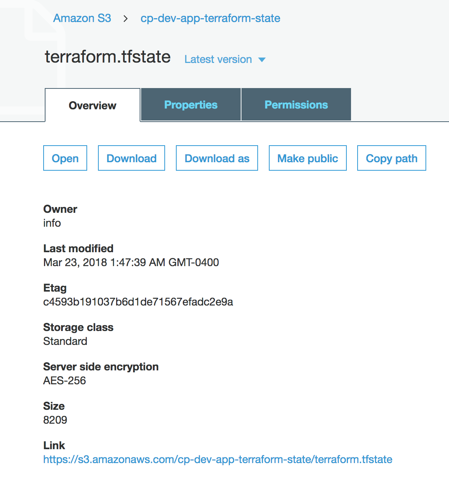

<!-- markdownlint-disable -->
# terraform-aws-tfstate-backend [](https://github.com/cloudposse/terraform-aws-tfstate-backend/releases/latest) [](https://slack.cloudposse.com)
<!-- markdownlint-restore -->

[![README Header][readme_header_img]][readme_header_link]

[![Cloud Posse][logo]](https://cpco.io/homepage)

<!--


  ** DO NOT EDIT THIS FILE
  **
  ** This file was automatically generated by the `build-harness`.
  ** 1) Make all changes to `README.yaml`
  ** 2) Run `make init` (you only need to do this once)
  ** 3) Run`make readme` to rebuild this file.
  **
  ** (We maintain HUNDREDS of open source projects. This is how we maintain our sanity.)
  **


-->

Terraform module to provision an S3 bucket to store `terraform.tfstate` file and a DynamoDB table to lock the state file
to prevent concurrent modifications and state corruption.

The module supports the following:

1. Forced server-side encryption at rest for the S3 bucket
2. S3 bucket versioning to allow for Terraform state recovery in the case of accidental deletions and human errors
3. State locking and consistency checking via DynamoDB table to prevent concurrent operations
4. DynamoDB server-side encryption

https://www.terraform.io/docs/backends/types/s3.html


__NOTE:__ The operators of the module (IAM Users) must have permissions to create S3 buckets and DynamoDB tables when performing `terraform plan` and `terraform apply`

__NOTE:__ This module cannot be used to apply changes to the `mfa_delete` feature of the bucket. Changes regarding mfa_delete can only be made manually using the root credentials with MFA of the AWS Account where the bucket resides. Please see: https://github.com/terraform-providers/terraform-provider-aws/issues/62

---

This project is part of our comprehensive ["SweetOps"](https://cpco.io/sweetops) approach towards DevOps.
[][share_email]
[][share_googleplus]
[][share_facebook]
[][share_reddit]
[][share_linkedin]
[][share_twitter]


[][terraform_modules]


It's 100% Open Source and licensed under the [APACHE2](LICENSE).


We literally have [*hundreds of terraform modules*][terraform_modules] that are Open Source and well-maintained. Check them out!


## Security & Compliance [](https://bridgecrew.io/)

Security scanning is graciously provided by Bridgecrew. Bridgecrew is the leading fully hosted, cloud-native solution providing continuous Terraform security and compliance.

| Benchmark | Description |
|--------|---------------|
| [](https://www.bridgecrew.cloud/link/badge?vcs=github&fullRepo=cloudposse%2Fterraform-aws-tfstate-backend&benchmark=INFRASTRUCTURE+SECURITY) | Infrastructure Security Compliance |
| [](https://www.bridgecrew.cloud/link/badge?vcs=github&fullRepo=cloudposse%2Fterraform-aws-tfstate-backend&benchmark=CIS+KUBERNETES+V1.5) | Center for Internet Security, KUBERNETES Compliance |
| [](https://www.bridgecrew.cloud/link/badge?vcs=github&fullRepo=cloudposse%2Fterraform-aws-tfstate-backend&benchmark=CIS+AWS+V1.2) | Center for Internet Security, AWS Compliance |
| [](https://www.bridgecrew.cloud/link/badge?vcs=github&fullRepo=cloudposse%2Fterraform-aws-tfstate-backend&benchmark=CIS+AZURE+V1.1) | Center for Internet Security, AZURE Compliance |
| [](https://www.bridgecrew.cloud/link/badge?vcs=github&fullRepo=cloudposse%2Fterraform-aws-tfstate-backend&benchmark=PCI-DSS+V3.2) | Payment Card Industry Data Security Standards Compliance |
| [](https://www.bridgecrew.cloud/link/badge?vcs=github&fullRepo=cloudposse%2Fterraform-aws-tfstate-backend&benchmark=NIST-800-53) | National Institute of Standards and Technology Compliance |
| [](https://www.bridgecrew.cloud/link/badge?vcs=github&fullRepo=cloudposse%2Fterraform-aws-tfstate-backend&benchmark=ISO27001) | Information Security Management System, ISO/IEC 27001 Compliance |
| [](https://www.bridgecrew.cloud/link/badge?vcs=github&fullRepo=cloudposse%2Fterraform-aws-tfstate-backend&benchmark=SOC2)| Service Organization Control 2 Compliance |
| [](https://www.bridgecrew.cloud/link/badge?vcs=github&fullRepo=cloudposse%2Fterraform-aws-tfstate-backend&benchmark=CIS+GCP+V1.1) | Center for Internet Security, GCP Compliance |
| [](https://www.bridgecrew.cloud/link/badge?vcs=github&fullRepo=cloudposse%2Fterraform-aws-tfstate-backend&benchmark=HIPAA) | Health Insurance Portability and Accountability Compliance |


## Usage


**IMPORTANT:** We do not pin modules to versions in our examples because of the
difficulty of keeping the versions in the documentation in sync with the latest released versions.
We highly recommend that in your code you pin the version to the exact version you are
using so that your infrastructure remains stable, and update versions in a
systematic way so that they do not catch you by surprise.

Also, because of a bug in the Terraform registry ([hashicorp/terraform#21417](https://github.com/hashicorp/terraform/issues/21417)),
the registry shows many of our inputs as required when in fact they are optional.
The table below correctly indicates which inputs are required.


### Create

Follow this procedure just once to create your deployment.

1. Add the `terraform_state_backend` module to your `main.tf` file. The
   comment will help you remember to follow this procedure in the future:
   ```hcl
   # You cannot create a new backend by simply defining this and then
   # immediately proceeding to "terraform apply". The S3 backend must
   # be bootstrapped according to the simple yet essential procedure in
   # https://github.com/cloudposse/terraform-aws-tfstate-backend#usage
   module "terraform_state_backend" {
     source = "cloudposse/tfstate-backend/aws"
     # Cloud Posse recommends pinning every module to a specific version
     # version     = "x.x.x"
     namespace  = "eg"
     stage      = "test"
     name       = "terraform"
     attributes = ["state"]

     terraform_backend_config_file_path = "."
     terraform_backend_config_file_name = "backend.tf"
     force_destroy                      = false
   }

   # Your Terraform configuration
   module "another_module" {
     source = "....."
   }
   ```
   Module inputs `terraform_backend_config_file_path` and
   `terraform_backend_config_file_name` control the name of the backend
   definition file. Note that when `terraform_backend_config_file_path` is
   empty (the default), no file is created.

1. `terraform init`. This downloads Terraform modules and providers.

1. `terraform apply -auto-approve`. This creates the state bucket and DynamoDB locking
   table, along with anything else you have defined in your `*.tf` file(s). At
   this point, the Terraform state is still stored locally.

   Module `terraform_state_backend` also creates a new `backend.tf` file
   that defines the S3 state backend. For example:
   ```hcl
   backend "s3" {
     region         = "us-east-1"
     bucket         = "< the name of the S3 state bucket >"
     key            = "terraform.tfstate"
     dynamodb_table = "< the name of the DynamoDB locking table >"
     profile        = ""
     role_arn       = ""
     encrypt        = true
   }
   ```

   Henceforth, Terraform will also read this newly-created backend definition
   file.

1. `terraform init -force-copy`. Terraform detects that you want to move your
   Terraform state to the S3 backend, and it does so per `-auto-approve`. Now the
   state is stored in the S3 bucket, and the DynamoDB table will be used to lock
   the state to prevent concurrent modification.

This concludes the one-time preparation. Now you can extend and modify your
Terraform configuration as usual.

### Destroy

Follow this procedure to delete your deployment.

1. In `main.tf`, change the `terraform_state_backend` module arguments as
   follows:
   ```hcl
    module "terraform_state_backend" {
      # ...
      terraform_backend_config_file_path = ""
      force_destroy                      = true
    }
    ```
1. `terraform apply -target module.terraform_state_backend -auto-approve`.
   This implements the above modifications by deleting the `backend.tf` file
   and enabling deletion of the S3 state bucket.
1. `terraform init -force-copy`. Terraform detects that you want to move your
   Terraform state from the S3 backend to local files, and it does so per
   `-auto-approve`. Now the state is once again stored locally and the S3
   state bucket can be safely deleted.
1. `terraform destroy`. This deletes all resources in your deployment.
1. Examine local state file `terraform.tfstate` to verify that it contains
   no resources.

<br/>



### Bucket Replication (Disaster Recovery)

To enable S3 bucket replication in this module, set `s3_replication_enabled` to `true` and populate `s3_replica_bucket_arn` with the ARN of an existing bucket.

```hcl
module "terraform_state_backend" {
  source = "cloudposse/tfstate-backend/aws"
  # Cloud Posse recommends pinning every module to a specific version
  # version     = "x.x.x"
  namespace  = "eg"
  stage      = "test"
  name       = "terraform"
  attributes = ["state"]

  terraform_backend_config_file_path = "."
  terraform_backend_config_file_name = "backend.tf"
  force_destroy                      = false

  s3_replication_enabled = true
  s3_replica_bucket_arn  = "arn:aws:s3:::eg-test-terraform-tfstate-replica"
}
```


<!-- markdownlint-disable -->
## Makefile Targets
```text
Available targets:

  help                                Help screen
  help/all                            Display help for all targets
  help/short                          This help short screen
  lint                                Lint terraform code

```
<!-- markdownlint-restore -->
<!-- markdownlint-disable -->
## Requirements

| Name | Version |
|------|---------|
| <a name="requirement_terraform"></a> [terraform](#requirement\_terraform) | >= 1.1.0 |
| <a name="requirement_aws"></a> [aws](#requirement\_aws) | >= 4.9.0 |
| <a name="requirement_local"></a> [local](#requirement\_local) | >= 2.0 |

## Providers

| Name | Version |
|------|---------|
| <a name="provider_aws"></a> [aws](#provider\_aws) | >= 4.9.0 |
| <a name="provider_local"></a> [local](#provider\_local) | >= 2.0 |

## Modules

| Name | Source | Version |
|------|--------|---------|
| <a name="module_bucket_label"></a> [bucket\_label](#module\_bucket\_label) | cloudposse/label/null | 0.25.0 |
| <a name="module_dynamodb_table_label"></a> [dynamodb\_table\_label](#module\_dynamodb\_table\_label) | cloudposse/label/null | 0.25.0 |
| <a name="module_replication_label"></a> [replication\_label](#module\_replication\_label) | cloudposse/label/null | 0.25.0 |
| <a name="module_this"></a> [this](#module\_this) | cloudposse/label/null | 0.25.0 |

## Resources

| Name | Type |
|------|------|
| [aws_dynamodb_table.with_server_side_encryption](https://registry.terraform.io/providers/hashicorp/aws/latest/docs/resources/dynamodb_table) | resource |
| [aws_iam_policy.replication](https://registry.terraform.io/providers/hashicorp/aws/latest/docs/resources/iam_policy) | resource |
| [aws_iam_role.replication](https://registry.terraform.io/providers/hashicorp/aws/latest/docs/resources/iam_role) | resource |
| [aws_iam_role_policy_attachment.replication](https://registry.terraform.io/providers/hashicorp/aws/latest/docs/resources/iam_role_policy_attachment) | resource |
| [aws_s3_bucket.default](https://registry.terraform.io/providers/hashicorp/aws/latest/docs/resources/s3_bucket) | resource |
| [aws_s3_bucket_acl.default](https://registry.terraform.io/providers/hashicorp/aws/latest/docs/resources/s3_bucket_acl) | resource |
| [aws_s3_bucket_logging.default](https://registry.terraform.io/providers/hashicorp/aws/latest/docs/resources/s3_bucket_logging) | resource |
| [aws_s3_bucket_ownership_controls.default](https://registry.terraform.io/providers/hashicorp/aws/latest/docs/resources/s3_bucket_ownership_controls) | resource |
| [aws_s3_bucket_policy.default](https://registry.terraform.io/providers/hashicorp/aws/latest/docs/resources/s3_bucket_policy) | resource |
| [aws_s3_bucket_public_access_block.default](https://registry.terraform.io/providers/hashicorp/aws/latest/docs/resources/s3_bucket_public_access_block) | resource |
| [aws_s3_bucket_replication_configuration.replication](https://registry.terraform.io/providers/hashicorp/aws/latest/docs/resources/s3_bucket_replication_configuration) | resource |
| [aws_s3_bucket_server_side_encryption_configuration.default](https://registry.terraform.io/providers/hashicorp/aws/latest/docs/resources/s3_bucket_server_side_encryption_configuration) | resource |
| [aws_s3_bucket_versioning.default](https://registry.terraform.io/providers/hashicorp/aws/latest/docs/resources/s3_bucket_versioning) | resource |
| [local_file.terraform_backend_config](https://registry.terraform.io/providers/hashicorp/local/latest/docs/resources/file) | resource |
| [aws_iam_policy_document.prevent_unencrypted_uploads](https://registry.terraform.io/providers/hashicorp/aws/latest/docs/data-sources/iam_policy_document) | data source |
| [aws_iam_policy_document.replication](https://registry.terraform.io/providers/hashicorp/aws/latest/docs/data-sources/iam_policy_document) | data source |
| [aws_iam_policy_document.replication_sts](https://registry.terraform.io/providers/hashicorp/aws/latest/docs/data-sources/iam_policy_document) | data source |
| [aws_region.current](https://registry.terraform.io/providers/hashicorp/aws/latest/docs/data-sources/region) | data source |

## Inputs

| Name | Description | Type | Default | Required |
|------|-------------|------|---------|:--------:|
| <a name="input_acl"></a> [acl](#input\_acl) | The canned ACL to apply to the S3 bucket | `string` | `"private"` | no |
| <a name="input_additional_tag_map"></a> [additional\_tag\_map](#input\_additional\_tag\_map) | Additional key-value pairs to add to each map in `tags_as_list_of_maps`. Not added to `tags` or `id`.<br>This is for some rare cases where resources want additional configuration of tags<br>and therefore take a list of maps with tag key, value, and additional configuration. | `map(string)` | `{}` | no |
| <a name="input_arn_format"></a> [arn\_format](#input\_arn\_format) | ARN format to be used. May be changed to support deployment in GovCloud/China regions. | `string` | `"arn:aws"` | no |
| <a name="input_attributes"></a> [attributes](#input\_attributes) | ID element. Additional attributes (e.g. `workers` or `cluster`) to add to `id`,<br>in the order they appear in the list. New attributes are appended to the<br>end of the list. The elements of the list are joined by the `delimiter`<br>and treated as a single ID element. | `list(string)` | `[]` | no |
| <a name="input_billing_mode"></a> [billing\_mode](#input\_billing\_mode) | DynamoDB billing mode | `string` | `"PAY_PER_REQUEST"` | no |
| <a name="input_block_public_acls"></a> [block\_public\_acls](#input\_block\_public\_acls) | Whether Amazon S3 should block public ACLs for this bucket | `bool` | `true` | no |
| <a name="input_block_public_policy"></a> [block\_public\_policy](#input\_block\_public\_policy) | Whether Amazon S3 should block public bucket policies for this bucket | `bool` | `true` | no |
| <a name="input_bucket_enabled"></a> [bucket\_enabled](#input\_bucket\_enabled) | Whether to create the S3 bucket. | `bool` | `true` | no |
| <a name="input_bucket_ownership_enforced_enabled"></a> [bucket\_ownership\_enforced\_enabled](#input\_bucket\_ownership\_enforced\_enabled) | Set bucket object ownership to "BucketOwnerEnforced". Disables ACLs. | `bool` | `true` | no |
| <a name="input_context"></a> [context](#input\_context) | Single object for setting entire context at once.<br>See description of individual variables for details.<br>Leave string and numeric variables as `null` to use default value.<br>Individual variable settings (non-null) override settings in context object,<br>except for attributes, tags, and additional\_tag\_map, which are merged. | `any` | <pre>{<br>  "additional_tag_map": {},<br>  "attributes": [],<br>  "delimiter": null,<br>  "descriptor_formats": {},<br>  "enabled": true,<br>  "environment": null,<br>  "id_length_limit": null,<br>  "label_key_case": null,<br>  "label_order": [],<br>  "label_value_case": null,<br>  "labels_as_tags": [<br>    "unset"<br>  ],<br>  "name": null,<br>  "namespace": null,<br>  "regex_replace_chars": null,<br>  "stage": null,<br>  "tags": {},<br>  "tenant": null<br>}</pre> | no |
| <a name="input_delimiter"></a> [delimiter](#input\_delimiter) | Delimiter to be used between ID elements.<br>Defaults to `-` (hyphen). Set to `""` to use no delimiter at all. | `string` | `null` | no |
| <a name="input_descriptor_formats"></a> [descriptor\_formats](#input\_descriptor\_formats) | Describe additional descriptors to be output in the `descriptors` output map.<br>Map of maps. Keys are names of descriptors. Values are maps of the form<br>`{<br>   format = string<br>   labels = list(string)<br>}`<br>(Type is `any` so the map values can later be enhanced to provide additional options.)<br>`format` is a Terraform format string to be passed to the `format()` function.<br>`labels` is a list of labels, in order, to pass to `format()` function.<br>Label values will be normalized before being passed to `format()` so they will be<br>identical to how they appear in `id`.<br>Default is `{}` (`descriptors` output will be empty). | `any` | `{}` | no |
| <a name="input_dynamodb_enabled"></a> [dynamodb\_enabled](#input\_dynamodb\_enabled) | Whether to create the DynamoDB table. | `bool` | `true` | no |
| <a name="input_dynamodb_table_name"></a> [dynamodb\_table\_name](#input\_dynamodb\_table\_name) | Override the name of the DynamoDB table which defaults to using `module.dynamodb_table_label.id` | `string` | `null` | no |
| <a name="input_enable_point_in_time_recovery"></a> [enable\_point\_in\_time\_recovery](#input\_enable\_point\_in\_time\_recovery) | Enable DynamoDB point-in-time recovery | `bool` | `true` | no |
| <a name="input_enable_public_access_block"></a> [enable\_public\_access\_block](#input\_enable\_public\_access\_block) | Enable Bucket Public Access Block | `bool` | `true` | no |
| <a name="input_enabled"></a> [enabled](#input\_enabled) | Set to false to prevent the module from creating any resources | `bool` | `null` | no |
| <a name="input_environment"></a> [environment](#input\_environment) | ID element. Usually used for region e.g. 'uw2', 'us-west-2', OR role 'prod', 'staging', 'dev', 'UAT' | `string` | `null` | no |
| <a name="input_force_destroy"></a> [force\_destroy](#input\_force\_destroy) | A boolean that indicates the S3 bucket can be destroyed even if it contains objects. These objects are not recoverable | `bool` | `false` | no |
| <a name="input_id_length_limit"></a> [id\_length\_limit](#input\_id\_length\_limit) | Limit `id` to this many characters (minimum 6).<br>Set to `0` for unlimited length.<br>Set to `null` for keep the existing setting, which defaults to `0`.<br>Does not affect `id_full`. | `number` | `null` | no |
| <a name="input_ignore_public_acls"></a> [ignore\_public\_acls](#input\_ignore\_public\_acls) | Whether Amazon S3 should ignore public ACLs for this bucket | `bool` | `true` | no |
| <a name="input_label_key_case"></a> [label\_key\_case](#input\_label\_key\_case) | Controls the letter case of the `tags` keys (label names) for tags generated by this module.<br>Does not affect keys of tags passed in via the `tags` input.<br>Possible values: `lower`, `title`, `upper`.<br>Default value: `title`. | `string` | `null` | no |
| <a name="input_label_order"></a> [label\_order](#input\_label\_order) | The order in which the labels (ID elements) appear in the `id`.<br>Defaults to ["namespace", "environment", "stage", "name", "attributes"].<br>You can omit any of the 6 labels ("tenant" is the 6th), but at least one must be present. | `list(string)` | `null` | no |
| <a name="input_label_value_case"></a> [label\_value\_case](#input\_label\_value\_case) | Controls the letter case of ID elements (labels) as included in `id`,<br>set as tag values, and output by this module individually.<br>Does not affect values of tags passed in via the `tags` input.<br>Possible values: `lower`, `title`, `upper` and `none` (no transformation).<br>Set this to `title` and set `delimiter` to `""` to yield Pascal Case IDs.<br>Default value: `lower`. | `string` | `null` | no |
| <a name="input_labels_as_tags"></a> [labels\_as\_tags](#input\_labels\_as\_tags) | Set of labels (ID elements) to include as tags in the `tags` output.<br>Default is to include all labels.<br>Tags with empty values will not be included in the `tags` output.<br>Set to `[]` to suppress all generated tags.<br>**Notes:**<br>  The value of the `name` tag, if included, will be the `id`, not the `name`.<br>  Unlike other `null-label` inputs, the initial setting of `labels_as_tags` cannot be<br>  changed in later chained modules. Attempts to change it will be silently ignored. | `set(string)` | <pre>[<br>  "default"<br>]</pre> | no |
| <a name="input_logging"></a> [logging](#input\_logging) | Destination (S3 bucket name and prefix) for S3 Server Access Logs for the S3 bucket. | <pre>list(object({<br>    target_bucket = string<br>    target_prefix = string<br>  }))</pre> | `[]` | no |
| <a name="input_mfa_delete"></a> [mfa\_delete](#input\_mfa\_delete) | A boolean that indicates that versions of S3 objects can only be deleted with MFA. ( Terraform cannot apply changes of this value; https://github.com/terraform-providers/terraform-provider-aws/issues/629 ) | `bool` | `false` | no |
| <a name="input_name"></a> [name](#input\_name) | ID element. Usually the component or solution name, e.g. 'app' or 'jenkins'.<br>This is the only ID element not also included as a `tag`.<br>The "name" tag is set to the full `id` string. There is no tag with the value of the `name` input. | `string` | `null` | no |
| <a name="input_namespace"></a> [namespace](#input\_namespace) | ID element. Usually an abbreviation of your organization name, e.g. 'eg' or 'cp', to help ensure generated IDs are globally unique | `string` | `null` | no |
| <a name="input_permissions_boundary"></a> [permissions\_boundary](#input\_permissions\_boundary) | ARN of the policy that is used to set the permissions boundary for the IAM replication role | `string` | `""` | no |
| <a name="input_prevent_unencrypted_uploads"></a> [prevent\_unencrypted\_uploads](#input\_prevent\_unencrypted\_uploads) | Prevent uploads of unencrypted objects to S3 | `bool` | `true` | no |
| <a name="input_profile"></a> [profile](#input\_profile) | AWS profile name as set in the shared credentials file | `string` | `""` | no |
| <a name="input_read_capacity"></a> [read\_capacity](#input\_read\_capacity) | DynamoDB read capacity units when using provisioned mode | `number` | `5` | no |
| <a name="input_regex_replace_chars"></a> [regex\_replace\_chars](#input\_regex\_replace\_chars) | Terraform regular expression (regex) string.<br>Characters matching the regex will be removed from the ID elements.<br>If not set, `"/[^a-zA-Z0-9-]/"` is used to remove all characters other than hyphens, letters and digits. | `string` | `null` | no |
| <a name="input_restrict_public_buckets"></a> [restrict\_public\_buckets](#input\_restrict\_public\_buckets) | Whether Amazon S3 should restrict public bucket policies for this bucket | `bool` | `true` | no |
| <a name="input_role_arn"></a> [role\_arn](#input\_role\_arn) | The role to be assumed | `string` | `""` | no |
| <a name="input_s3_bucket_name"></a> [s3\_bucket\_name](#input\_s3\_bucket\_name) | S3 bucket name. If not provided, the name will be generated from the context by the label module. | `string` | `""` | no |
| <a name="input_s3_replica_bucket_arn"></a> [s3\_replica\_bucket\_arn](#input\_s3\_replica\_bucket\_arn) | The ARN of the S3 replica bucket (destination) | `string` | `""` | no |
| <a name="input_s3_replication_enabled"></a> [s3\_replication\_enabled](#input\_s3\_replication\_enabled) | Set this to true and specify `s3_replica_bucket_arn` to enable replication | `bool` | `false` | no |
| <a name="input_stage"></a> [stage](#input\_stage) | ID element. Usually used to indicate role, e.g. 'prod', 'staging', 'source', 'build', 'test', 'deploy', 'release' | `string` | `null` | no |
| <a name="input_tags"></a> [tags](#input\_tags) | Additional tags (e.g. `{'BusinessUnit': 'XYZ'}`).<br>Neither the tag keys nor the tag values will be modified by this module. | `map(string)` | `{}` | no |
| <a name="input_tenant"></a> [tenant](#input\_tenant) | ID element \_(Rarely used, not included by default)\_. A customer identifier, indicating who this instance of a resource is for | `string` | `null` | no |
| <a name="input_terraform_backend_config_file_name"></a> [terraform\_backend\_config\_file\_name](#input\_terraform\_backend\_config\_file\_name) | (Deprecated) Name of terraform backend config file to generate | `string` | `"terraform.tf"` | no |
| <a name="input_terraform_backend_config_file_path"></a> [terraform\_backend\_config\_file\_path](#input\_terraform\_backend\_config\_file\_path) | (Deprecated) Directory for the terraform backend config file, usually `.`. The default is to create no file. | `string` | `""` | no |
| <a name="input_terraform_backend_config_template_file"></a> [terraform\_backend\_config\_template\_file](#input\_terraform\_backend\_config\_template\_file) | (Deprecated) The path to the template used to generate the config file | `string` | `""` | no |
| <a name="input_terraform_state_file"></a> [terraform\_state\_file](#input\_terraform\_state\_file) | The path to the state file inside the bucket | `string` | `"terraform.tfstate"` | no |
| <a name="input_terraform_version"></a> [terraform\_version](#input\_terraform\_version) | The minimum required terraform version | `string` | `"1.0.0"` | no |
| <a name="input_write_capacity"></a> [write\_capacity](#input\_write\_capacity) | DynamoDB write capacity units when using provisioned mode | `number` | `5` | no |

## Outputs

| Name | Description |
|------|-------------|
| <a name="output_dynamodb_table_arn"></a> [dynamodb\_table\_arn](#output\_dynamodb\_table\_arn) | DynamoDB table ARN |
| <a name="output_dynamodb_table_id"></a> [dynamodb\_table\_id](#output\_dynamodb\_table\_id) | DynamoDB table ID |
| <a name="output_dynamodb_table_name"></a> [dynamodb\_table\_name](#output\_dynamodb\_table\_name) | DynamoDB table name |
| <a name="output_s3_bucket_arn"></a> [s3\_bucket\_arn](#output\_s3\_bucket\_arn) | S3 bucket ARN |
| <a name="output_s3_bucket_domain_name"></a> [s3\_bucket\_domain\_name](#output\_s3\_bucket\_domain\_name) | S3 bucket domain name |
| <a name="output_s3_bucket_id"></a> [s3\_bucket\_id](#output\_s3\_bucket\_id) | S3 bucket ID |
| <a name="output_s3_replication_role_arn"></a> [s3\_replication\_role\_arn](#output\_s3\_replication\_role\_arn) | The ARN of the IAM Role created for replication, if enabled. |
| <a name="output_terraform_backend_config"></a> [terraform\_backend\_config](#output\_terraform\_backend\_config) | Rendered Terraform backend config file |
<!-- markdownlint-restore -->


## Share the Love

Like this project? Please give it a ★ on [our GitHub](https://github.com/cloudposse/terraform-aws-tfstate-backend)! (it helps us **a lot**)

Are you using this project or any of our other projects? Consider [leaving a testimonial][testimonial]. =)


## Related Projects

Check out these related projects.

- [terraform-aws-dynamodb](https://github.com/cloudposse/terraform-aws-dynamodb) - Terraform module that implements AWS DynamoDB with support for AutoScaling
- [terraform-aws-dynamodb-autoscaler](https://github.com/cloudposse/terraform-aws-dynamodb-autoscaler) - Terraform module to provision DynamoDB autoscaler

## Help

**Got a question?** We got answers.

File a GitHub [issue](https://github.com/cloudposse/terraform-aws-tfstate-backend/issues), send us an [email][email] or join our [Slack Community][slack].

[![README Commercial Support][readme_commercial_support_img]][readme_commercial_support_link]

## DevOps Accelerator for Startups


We are a [**DevOps Accelerator**][commercial_support]. We'll help you build your cloud infrastructure from the ground up so you can own it. Then we'll show you how to operate it and stick around for as long as you need us.

[][commercial_support]

Work directly with our team of DevOps experts via email, slack, and video conferencing.

We deliver 10x the value for a fraction of the cost of a full-time engineer. Our track record is not even funny. If you want things done right and you need it done FAST, then we're your best bet.

- **Reference Architecture.** You'll get everything you need from the ground up built using 100% infrastructure as code.
- **Release Engineering.** You'll have end-to-end CI/CD with unlimited staging environments.
- **Site Reliability Engineering.** You'll have total visibility into your apps and microservices.
- **Security Baseline.** You'll have built-in governance with accountability and audit logs for all changes.
- **GitOps.** You'll be able to operate your infrastructure via Pull Requests.
- **Training.** You'll receive hands-on training so your team can operate what we build.
- **Questions.** You'll have a direct line of communication between our teams via a Shared Slack channel.
- **Troubleshooting.** You'll get help to triage when things aren't working.
- **Code Reviews.** You'll receive constructive feedback on Pull Requests.
- **Bug Fixes.** We'll rapidly work with you to fix any bugs in our projects.

## Slack Community

Join our [Open Source Community][slack] on Slack. It's **FREE** for everyone! Our "SweetOps" community is where you get to talk with others who share a similar vision for how to rollout and manage infrastructure. This is the best place to talk shop, ask questions, solicit feedback, and work together as a community to build totally *sweet* infrastructure.

## Discourse Forums

Participate in our [Discourse Forums][discourse]. Here you'll find answers to commonly asked questions. Most questions will be related to the enormous number of projects we support on our GitHub. Come here to collaborate on answers, find solutions, and get ideas about the products and services we value. It only takes a minute to get started! Just sign in with SSO using your GitHub account.

## Newsletter

Sign up for [our newsletter][newsletter] that covers everything on our technology radar.  Receive updates on what we're up to on GitHub as well as awesome new projects we discover.

## Office Hours

[Join us every Wednesday via Zoom][office_hours] for our weekly "Lunch & Learn" sessions. It's **FREE** for everyone!

[][office_hours]

## Contributing

### Bug Reports & Feature Requests

Please use the [issue tracker](https://github.com/cloudposse/terraform-aws-tfstate-backend/issues) to report any bugs or file feature requests.

### Developing

If you are interested in being a contributor and want to get involved in developing this project or [help out](https://cpco.io/help-out) with our other projects, we would love to hear from you! Shoot us an [email][email].

In general, PRs are welcome. We follow the typical "fork-and-pull" Git workflow.

 1. **Fork** the repo on GitHub
 2. **Clone** the project to your own machine
 3. **Commit** changes to your own branch
 4. **Push** your work back up to your fork
 5. Submit a **Pull Request** so that we can review your changes

**NOTE:** Be sure to merge the latest changes from "upstream" before making a pull request!


## Copyright

Copyright © 2017-2023 [Cloud Posse, LLC](https://cpco.io/copyright)


## License

[](https://opensource.org/licenses/Apache-2.0)

See [LICENSE](LICENSE) for full details.

```text
Licensed to the Apache Software Foundation (ASF) under one
or more contributor license agreements.  See the NOTICE file
distributed with this work for additional information
regarding copyright ownership.  The ASF licenses this file
to you under the Apache License, Version 2.0 (the
"License"); you may not use this file except in compliance
with the License.  You may obtain a copy of the License at

  https://www.apache.org/licenses/LICENSE-2.0

Unless required by applicable law or agreed to in writing,
software distributed under the License is distributed on an
"AS IS" BASIS, WITHOUT WARRANTIES OR CONDITIONS OF ANY
KIND, either express or implied.  See the License for the
specific language governing permissions and limitations
under the License.
```


## Trademarks

All other trademarks referenced herein are the property of their respective owners.

## About

This project is maintained and funded by [Cloud Posse, LLC][website]. Like it? Please let us know by [leaving a testimonial][testimonial]!

[![Cloud Posse][logo]][website]

We're a [DevOps Professional Services][hire] company based in Los Angeles, CA. We ❤️  [Open Source Software][we_love_open_source].

We offer [paid support][commercial_support] on all of our projects.

Check out [our other projects][github], [follow us on twitter][twitter], [apply for a job][jobs], or [hire us][hire] to help with your cloud strategy and implementation.


### Contributors

<!-- markdownlint-disable -->
|  [![Andriy Knysh][aknysh_avatar]][aknysh_homepage]<br/>[Andriy Knysh][aknysh_homepage] | [![Erik Osterman][osterman_avatar]][osterman_homepage]<br/>[Erik Osterman][osterman_homepage] | [![Maarten van der Hoef][maartenvanderhoef_avatar]][maartenvanderhoef_homepage]<br/>[Maarten van der Hoef][maartenvanderhoef_homepage] | [![Vladimir][SweetOps_avatar]][SweetOps_homepage]<br/>[Vladimir][SweetOps_homepage] | [![Chris Weyl][rsrchboy_avatar]][rsrchboy_homepage]<br/>[Chris Weyl][rsrchboy_homepage] | [![John McGehee][jmcgeheeiv_avatar]][jmcgeheeiv_homepage]<br/>[John McGehee][jmcgeheeiv_homepage] | [![Oliver L Schoenborn][schollii_avatar]][schollii_homepage]<br/>[Oliver L Schoenborn][schollii_homepage] | [![RB][nitrocode_avatar]][nitrocode_homepage]<br/>[RB][nitrocode_homepage] |
|---|---|---|---|---|---|---|---|
<!-- markdownlint-restore -->

  [aknysh_homepage]: https://github.com/aknysh
  [aknysh_avatar]: https://img.cloudposse.com/150x150/https://github.com/aknysh.png
  [osterman_homepage]: https://github.com/osterman
  [osterman_avatar]: https://img.cloudposse.com/150x150/https://github.com/osterman.png
  [maartenvanderhoef_homepage]: https://github.com/maartenvanderhoef
  [maartenvanderhoef_avatar]: https://img.cloudposse.com/150x150/https://github.com/maartenvanderhoef.png
  [SweetOps_homepage]: https://github.com/SweetOps
  [SweetOps_avatar]: https://img.cloudposse.com/150x150/https://github.com/SweetOps.png
  [rsrchboy_homepage]: https://github.com/rsrchboy
  [rsrchboy_avatar]: https://img.cloudposse.com/150x150/https://github.com/rsrchboy.png
  [jmcgeheeiv_homepage]: https://github.com/jmcgeheeiv
  [jmcgeheeiv_avatar]: https://img.cloudposse.com/150x150/https://github.com/jmcgeheeiv.png
  [schollii_homepage]: https://github.com/schollii
  [schollii_avatar]: https://img.cloudposse.com/150x150/https://github.com/schollii.png
  [nitrocode_homepage]: https://github.com/nitrocode
  [nitrocode_avatar]: https://img.cloudposse.com/150x150/https://github.com/nitrocode.png

[![README Footer][readme_footer_img]][readme_footer_link]
[![Beacon][beacon]][website]
<!-- markdownlint-disable -->
  [logo]: https://cloudposse.com/logo-300x69.svg
  [docs]: https://cpco.io/docs?utm_source=github&utm_medium=readme&utm_campaign=cloudposse/terraform-aws-tfstate-backend&utm_content=docs
  [website]: https://cpco.io/homepage?utm_source=github&utm_medium=readme&utm_campaign=cloudposse/terraform-aws-tfstate-backend&utm_content=website
  [github]: https://cpco.io/github?utm_source=github&utm_medium=readme&utm_campaign=cloudposse/terraform-aws-tfstate-backend&utm_content=github
  [jobs]: https://cpco.io/jobs?utm_source=github&utm_medium=readme&utm_campaign=cloudposse/terraform-aws-tfstate-backend&utm_content=jobs
  [hire]: https://cpco.io/hire?utm_source=github&utm_medium=readme&utm_campaign=cloudposse/terraform-aws-tfstate-backend&utm_content=hire
  [slack]: https://cpco.io/slack?utm_source=github&utm_medium=readme&utm_campaign=cloudposse/terraform-aws-tfstate-backend&utm_content=slack
  [linkedin]: https://cpco.io/linkedin?utm_source=github&utm_medium=readme&utm_campaign=cloudposse/terraform-aws-tfstate-backend&utm_content=linkedin
  [twitter]: https://cpco.io/twitter?utm_source=github&utm_medium=readme&utm_campaign=cloudposse/terraform-aws-tfstate-backend&utm_content=twitter
  [testimonial]: https://cpco.io/leave-testimonial?utm_source=github&utm_medium=readme&utm_campaign=cloudposse/terraform-aws-tfstate-backend&utm_content=testimonial
  [office_hours]: https://cloudposse.com/office-hours?utm_source=github&utm_medium=readme&utm_campaign=cloudposse/terraform-aws-tfstate-backend&utm_content=office_hours
  [newsletter]: https://cpco.io/newsletter?utm_source=github&utm_medium=readme&utm_campaign=cloudposse/terraform-aws-tfstate-backend&utm_content=newsletter
  [discourse]: https://ask.sweetops.com/?utm_source=github&utm_medium=readme&utm_campaign=cloudposse/terraform-aws-tfstate-backend&utm_content=discourse
  [email]: https://cpco.io/email?utm_source=github&utm_medium=readme&utm_campaign=cloudposse/terraform-aws-tfstate-backend&utm_content=email
  [commercial_support]: https://cpco.io/commercial-support?utm_source=github&utm_medium=readme&utm_campaign=cloudposse/terraform-aws-tfstate-backend&utm_content=commercial_support
  [we_love_open_source]: https://cpco.io/we-love-open-source?utm_source=github&utm_medium=readme&utm_campaign=cloudposse/terraform-aws-tfstate-backend&utm_content=we_love_open_source
  [terraform_modules]: https://cpco.io/terraform-modules?utm_source=github&utm_medium=readme&utm_campaign=cloudposse/terraform-aws-tfstate-backend&utm_content=terraform_modules
  [readme_header_img]: https://cloudposse.com/readme/header/img
  [readme_header_link]: https://cloudposse.com/readme/header/link?utm_source=github&utm_medium=readme&utm_campaign=cloudposse/terraform-aws-tfstate-backend&utm_content=readme_header_link
  [readme_footer_img]: https://cloudposse.com/readme/footer/img
  [readme_footer_link]: https://cloudposse.com/readme/footer/link?utm_source=github&utm_medium=readme&utm_campaign=cloudposse/terraform-aws-tfstate-backend&utm_content=readme_footer_link
  [readme_commercial_support_img]: https://cloudposse.com/readme/commercial-support/img
  [readme_commercial_support_link]: https://cloudposse.com/readme/commercial-support/link?utm_source=github&utm_medium=readme&utm_campaign=cloudposse/terraform-aws-tfstate-backend&utm_content=readme_commercial_support_link
  [share_twitter]: https://twitter.com/intent/tweet/?text=terraform-aws-tfstate-backend&url=https://github.com/cloudposse/terraform-aws-tfstate-backend
  [share_linkedin]: https://www.linkedin.com/shareArticle?mini=true&title=terraform-aws-tfstate-backend&url=https://github.com/cloudposse/terraform-aws-tfstate-backend
  [share_reddit]: https://reddit.com/submit/?url=https://github.com/cloudposse/terraform-aws-tfstate-backend
  [share_facebook]: https://facebook.com/sharer/sharer.php?u=https://github.com/cloudposse/terraform-aws-tfstate-backend
  [share_googleplus]: https://plus.google.com/share?url=https://github.com/cloudposse/terraform-aws-tfstate-backend
  [share_email]: mailto:?subject=terraform-aws-tfstate-backend&body=https://github.com/cloudposse/terraform-aws-tfstate-backend
  [beacon]: https://ga-beacon.cloudposse.com/UA-76589703-4/cloudposse/terraform-aws-tfstate-backend?pixel&cs=github&cm=readme&an=terraform-aws-tfstate-backend
<!-- markdownlint-restore -->
